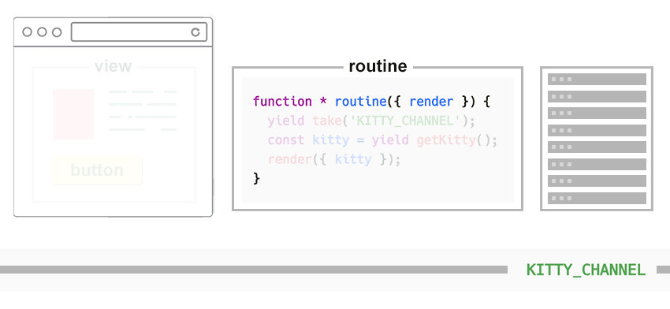

---

<h3 align="center">Reactive View</h3>

<p align="center"><b>Riew</b> is a reactive library that uses <a href="https://en.wikipedia.org/wiki/Communicating_sequential_processes">CSP</a> concepts for managing data and application flow.</p>

---

**📚 Learning materials**

* [Reactive view - the concept](https://krasimirtsonev.com/blog/article/riew-reactive-view-concept)
* [Part 1: We need channels! A gentle introduction to CSP](https://krasimirtsonev.com/blog/article/we-need-channels)
* [Part 2: Riew - reactive view basics](https://krasimirtsonev.com/blog/article/riew-reactive-view-intro)
* [Part 3: Riew - reactive view in patterns](https://krasimirtsonev.com/blog/article/riew-reactive-view-in-patterns)

**🎮 Playgrounds**

* [Online demo](http://poet.krasimir.now.sh/e/QMPvK8DM2s7).
* Examples
  * [ToDoMVC](https://github.com/krasimir/riew/tree/master/examples/todomvc)
  * [Questionnaire app](https://github.com/krasimir/riew/tree/master/examples/questionnaire)
  * [Counter](http://poet.krasimir.now.sh/e/gnv7EDgydsQ#App.js)
  * [Random cat](http://poet.krasimir.now.sh/e/exoE5zyxQhl)

---

**Table of contents**

- [Concepts](#concepts)
  - [Routines &amp; channels](#routines-amp-channels)
  - [Riews](#riews)
  - [Application state](#application-state)
  - [PubSub](#pubsub)
- [API](#api)
  - [chan](#chan)
  - [buffer](#buffer)
    - [buffer.fixed()](#bufferfixed)
    - [buffer.fixed(n)](#bufferfixedn)
    - [buffer.sliding(n)](#bufferslidingn)
    - [buffer.dropping(n)](#bufferdroppingn)
  - [fixed(n)](#fixedn)
  - [go](#go)
    - [Stopping a routine](#stopping-a-routine)
    - [Restarting the routine](#restarting-the-routine)
    - [What you can yield](#what-you-can-yield)
    - [Injecting external dependencies](#injecting-external-dependencies)
  - [put](#put)
  - [sput](#sput)
  - [take](#take)
  - [stake](#stake)
  - [close](#close)
  - [sclose](#sclose)
  - [read](#read)
  - [sread](#sread)
  - [unsubscribing](#unsubscribing)
  - [unreadAll](#unreadall)
  - [call](#call)
  - [fork](#fork)
  - [sleep](#sleep)
  - [stop](#stop)
  - [timeout](#timeout)
  - [merge](#merge)
  - [state](#state)
    - [selectors](#selectors)
    - [mutators](#mutators)
  - [riew](#riew)
    - [Riew routines](#riew-routines)
    - [Externals](#externals)
    - [Channels and state](#channels-and-state)
  - [react](#react)
  - [register](#register)
  - [use](#use)
  - [reset](#reset)
  - [constants](#constants)
- [Inspiration](#inspiration)

## Concepts

### Routines & channels

Imagine that you need to transfer messages between two functions in your system. They don't know about each other. With Riew you can use a _channel_ to connect and synchronize them. We can put and take messages from that channel. Consider the following example:

```js
const ch = chan();

go(function * A() {
  const name = yield take(ch);
  yield put(ch, `Hey ${name}, how are you?`);
});
go(function * B() {
  yield put(ch, "Steve");
  console.log(yield take(ch));
});
```

We have two generator functions (routines) `A` and `B`. They start synchronously one after each other. However, `A` is paused (blocked) at the `yield take` statement because it wants to read from the channel `ch` but there is nothing inside. Then routine `B` puts `Steve` and routine `A` resumes back. Now `B` is blocked because it tries to read from the same channel. `Steve` is already consumed by the other routine so we are again at the same blocking situation. `B` waits till `A` puts `Hello Steve, how are you?`. At the end the log happens and we see the message into the console.

This is the basic idea behind [CSP](https://en.wikipedia.org/wiki/Communicating_sequential_processes). We have channels that are used for communication and synchronization. By default the channel operations are blocking. Putting can't happen until there is someone to take and the opposite - taking can't happen until there is someone to put. This is the behavior of the standard non-buffered channel or the so called _fixed_ buffer. There are couple of other types and we will learn about them below.

As for the routines, we may `yield` all sort of things. We may `put`, `take`, `sleep` but we may also `yield` a promise. Then Riew will wait till the promise is resolved and will resume the generator. We may even use the `call` and `fork` helpers to run other routines. 😮

### Riews

The _riew_ is a combination between _view_ function and routine functions. It's materialized into an object that has `mount`, `update` and `unmount` methods. The routines get started when we mount the riew. They receive a `render` method so we can send data to the view function.

```js
const ch = chan();
const view = function(props) {
  console.log(props);
};
function* A() {
  const name = yield take(ch);
  yield put(ch, `Hey ${name}, how are you?`);
}
function* B({ render }) {
  yield put(ch, 'Steve');
  render({ message: yield take(ch) });
}

const r = riew(view, A, B);

r.mount();
```

This example prints out an object `{ message: "Hey Steve, how are you?" }`. As we know from the previous section, `B` routine waits till it receives the message formatted by routine `A`. It sends it to the `view` function by using the `render` function. This code sample illustrates one of the core concept behind this library - keep the view pure and distribute the business logic across routines.

We may directly send a channel to the `render` function and whatever we `put` inside will reach the view. For example:

```js
const view = function (props) {
  console.log(props);
}
function * A({ render }) {
  const ch = chan();
  render({ name: ch })
  yield put(ch, 'Martin');
}

const r = riew(view, A);

r.mount();
```

The result here is `{ name: 'Martin' }`.

_(There is a [React extension](https://github.com/krasimir/riew#react) bundled within the library so if you use React you'll probably never call `mount`, `update` and `unmount` manually. This is done by the library.)_

### Application state

In the original [CSP](https://en.wikipedia.org/wiki/Communicating_sequential_processes) paper there is no concept of a _state_. At least not in the same way as we use it in JavaScript today. For us _state_ is a value that persist across time. It can be accessed, changed and it is always available. The channels can keep values but they are consumed at some point. Or in other words _taken_ and don't exists as such in the channels anymore.

Riew brings the idea of a state by defining a value that is outside the channels. It can be however accessed and modified by using channels. Imagine the state as a black box with a value and channels for writing and reading that value. Riew follows this idea by allowing the definition of multiple read channels called _selectors_ and multiple write channels called _mutators_. Let's see an example:

```js
// A state which value is an empty array.
const users = state([]);

// Channel for updating the state value.
const add = users.mutate(function reducer(currentUsers, newUser) {
  return [...currentUsers, newUser];
});
// Channel for reading the state value.
const getUsers = users.select(function mapping(users) {
  return users.map(({ name }) => name).join(', ');
});

go(function* A() {
  yield put(add, { name: 'Steve', age: 24 });
  yield put(add, { name: 'Ana', age: 25 });
  yield put(add, { name: 'Peter', age: 22 });
  console.log(yield take(getUsers)); // Steve, Ana, Peter
});
```

The `mutate` method of the state accepts a `reducer` function and returns a channel. Let's say that we put "foo" in the channel. The reducer will be called with the current state value followed by "foo" string.

The `select` method returns a channel which we can read from and the value is whatever the `mapping` function returns. That function receives the current state value and returns it. Or maybe just a portion of it. Or perhaps a different representation of the data. Like in our case we return a comma separated list of user names.

A helpful pattern is to use a routine as a mutator. And because the routine may be asynchronous you may block until the mutation is done. Consider the trivial case where we have to get data from remote endpoint and show it to the user.

```js
const cat = state(null);
const getKitty = cat.mutate(function * () {
  const { file } = yield fetch('https://aws.random.cat/meow').then(res => res.json());
  return file;
});

go(function * A() {
  console.log('I want a kitty.');
  yield put(getKitty);
  console.log(`Here we go ${ yield take(cat) }`);
});
```

The routine `A` is blocked on the put to `put(getKitty)`. Our mutator is picked up and makes a request to `https://aws.random.cat/meow`. Once it finishes it mutates the state and replaces `null` with a URL. Then our routine is resumed and we can print that URL.

```js
> I want a kitty.
> Here we go https://purr.objects-us-east-1.dream.io/i/W6jh8.jpg
```

Further more we can handle the request error inside the mutator and put something else in the `cat` state.

### PubSub

The [PubSub](https://en.wikipedia.org/wiki/Publish%E2%80%93subscribe_pattern) pattern is widely used in JavaScript. There are tons of libraries that are using it and it's a de-facto standard these days. I (the author of this library) however think that this pattern doesn't play well with the [CSP](https://en.wikipedia.org/wiki/Communicating_sequential_processes) concepts. I've made couple of tests and tried implementing it with pure CSP concepts but it simply doesn't work as expected. That's because in the PubSub pattern we have a broadcasting system. A system in which the dispatcher of the message doesn't care what happens with the dispatched message. The act of message sending is not a blocking operation. In CSP is quite opposite. When we put something into the channel we are blocked until someone takes it. Also in PubSub we have one-to-many relationship and all the subscribers receive the same message. While in CSP if we hook multiple takers to a channel they'll all receive different messages because once the message is consumed it disappears from the channel and the next taker will read the next message. CSP and PubSub are kind of similar concepts. They both follow the push model and could be used to write code in a reactive way. However, they act differently.

Riew offers PubSub pattern capabilities. They are however added next to the core CSP processes and the developer needs to make a clear separation between the two. Consider the following example:

```js
go(function* A() {
  console.log(`Value: ${yield read(ch)}`);
});
go(function* B() {
  yield put(ch, 'Foo');
  console.log('Bar');
});
```

The result of this snippet is only `"Value: undefined"`. The [read](https://github.com/krasimir/riew#read) function only **reads** the value but doesn't consume it from the channel. It also resoloves with whatever the channel contains at this exact moment. Above we are getting `undefined` because there is nothing in the channel yet. Also routine `B` stays blocked because there is no [taker](https://github.com/krasimir/riew#take) for the `ch` channel.

By default `read` (and its standalone version `sread`) is one-shot operation. This means that we aread and move forward. However, we may use the `listen` method and effectively subscribe for values passed to the channel.

```js
const ch = chan();

listen(ch, value => {
  console.log(`Value: ${value}`);
});

sput(ch, 'foo'); // Value: foo
sput(ch, 'bar'); // Value: bar
sput(ch, 'moo'); // Value: moo
```

So, there is a way to use the PubSub pattern. It's just the difference between _reading_ and _taking_.

## API

### chan

> `chan(id, buff)` or `chan(buff)`

Creates a new channel with ID equal to `id` and buffer equal to `buff`.

* `id` (`String`, optional) - must be unique for your system. If not specified it will be auto-generated by the library.
* `buff` (`Buffer`, optional) - buffer created by using the [`buffer`](https://github.com/krasimir/riew#buffer) helpers. If not specified `buffer.fixed()` is used.

The function returns a channel object with the following methods/fields:

* `channel.id` - the ID of the channel.
* `channel.isActive()` - returns `true` if the channel is in an `OPEN` state.
* `channel.state()` - returns one of the following: `OPEN`, `CLOSED` or `ENDED`. When the `channel` is `OPEN` we can put and take from it. When it is `CLOSED` every put gets resolved with `CLOSED`. The `take` on a `CLOSED` channel consumes the values left in the channel. If no values the `take` will be resolved with `CLOSED`. When a channel is `ENDED` both `put` and `take` are resolved with `ENDED`.

Example:

```js
const ch = chan('FOOBAR');

console.log(ch.id); // FOOBAR
console.log(ch.state()); // Symbol(OPEN)
console.log(ch.isActive()); // true
```

### buffer

#### buffer.fixed()

It creates a fixed buffer with size 0. The `put` to the channel is blocked until a `take` happens. A `take` is blocked until a `put` happens.

Example:

```js
const ch = chan(buffer.fixed());

go(function * A() {
  yield put(ch, 'foo');
});
go(function * B() {
  yield sleep(1000);
  const value = yield take(ch);
  console.log(value); // foo
});
```

1. Routine A starts and stops at the `yield put`.
2. Routine B starts and stops at `yield sleep` for one second.
3. Routine B is resumed and `take`s 'foo' from the channel.
4. Routine A is resumed and it ends.
5. Routine B ends with `value` equal to `foo`.

#### buffer.fixed(n)

It creates a fixed buffer with size `n`. `n` number of puts are non-blocking and the buffer holds the values till they are consumed. The `n + 1` put is blocking.

Example:

```js
const ch = chan('MYCHANNEL', buffer.fixed(2));

go(function* A() {
  yield put(ch, 'foo');
  console.log('a');
  yield put(ch, 'bar');
  console.log('b');
  yield put(ch, 'moo');
  console.log('c');
});
go(function* B() {
  yield sleep(2000);
  console.log(yield take(ch));
  console.log(yield take(ch));
  console.log(yield take(ch));
});
```

1. Routine A starts and we see `"a"` and `"b"` in the console. It's because we have a buffer with size 2.
3. Routine B starts and stops at `yield sleep(2000)` for two seconds.
4. Routine B continues and consumes all the values from the channel including `"moo"`.

#### buffer.sliding(n)

Similar to the fixed buffer except that the `put`s are never blocking. If the buffer is full a new item is added at the end but one item is removed from the beginning.

Example:

```js
const ch = chan('MYCHANNEL', buffer.sliding(2));

go(function * A() {
  yield put(ch, 'foo');
  yield put(ch, 'bar');
  yield put(ch, 'moo');
  yield put(ch, 'zoo');
});
go(function * B() {
  yield sleep(2000);
  console.log(yield take(ch));
  console.log(yield take(ch));
});
```

1. Routine A starts and all the puts happen with no stopping of the generator.
2. Routine B starts and in the channel we have `["moo", "zoo"]`.
3. Routine B ends and in the console we see `"moo"` followed by `"zoo"`.

#### buffer.dropping(n)

Similar to the fixed buffer except that every `put` outside of the buffer range is not blocking the routing. It resolves with `true` if there is space in the buffer and `false` if not. If there is no space for new values it's simply ignored.

Example:

```js
const ch = chan('MYCHANNEL', buffer.dropping(2));

go(function * A() {
  yield put(ch, 'foo');
  yield put(ch, 'bar');
  yield put(ch, 'moo');
  yield put(ch, 'zoo');
});
go(function * B() {
  yield sleep(2000);
  console.log(yield take(ch));
  console.log(yield take(ch));
});
```

1. Routine A starts and all the puts happen with no stopping of the generator. It's just the last two do nothing.
2. Routine B starts and in the channel we have `["foo", "bar"]`.
3. Routine B ends and in the console we see `"foo"` followed by `"bar"`.

### fixed(n)


### go

> `go(routine, done, ...routineArgs)`

Runs a routine.

* `routine` (`Generator`, required) - a generator function
* `done` (`Function`, optional) - a callback function which is fired when the routine ends.
* `routineArgs` (`Any`, optional) - any optional arguments that come as arguments to our generator.

Example:

```js
const ch = chan();

go(
  function * A(greeting) {
    const name = yield take(ch);
    return `${ greeting }, ${ name }`;
  },
  (v) => {
    console.log(v);
  },
  'Hey'
);
go(function * B() {
  yield put(ch, 'Pablo')
});
```

1. `go` runs a routine `A` with one argument `"Hey"`. The routine stops at `yield take(ch)`.
2. Routine `B` starts and we put `"Pablo"` to the channel `ch`.
3. Routine `A` is resumed and forms its result which is `Hey, Pablo`.
4. The routine done callback is called and we see the result in the console.

#### Stopping a routine

The `go` function returns an object that has a `stop` method. Once you call it the routine will be terminated.

```js
const routine = go(function * () {
  yield sleep(1000);
  // This line will never be executed because
  // the routine is terminated before it gets resumed.
  console.log('Never called!'); 
});

routine.stop(); // <-- this terminates the routine
```

Another way to stop the routine is to yield `stop()`. This is not the same as writing `return` because `return` will fire the `done` callback of the routine. `stop()` is about terminating it. In the following example we'll see only `"done B"`.

```js
go(function * A() {
  yield stop();
  console.log('Never called!');
}, () => console.log('done A'));

go(function * B() {
  return;
  console.log('Never called!');
}, () => console.log('done B'));
```

The routine is automatically terminated if it's part of a [riew](https://github.com/krasimir/riew#riew) and the riew is unmounted.

```js
const routine = function * () {
  yield sleep(1000);
  // This line will never be executed because
  // the routine is terminated before it gets resumed.
  console.log('Never called!');
};

const r = riew(() => {}, routine);

r.mount();
r.unmount(); // <-- this terminates the routine
```

#### Restarting the routine

Re-running a routine means terminating the current processes and running the generator again.

The `go` function returns an object that has a `rerun` method. Once you call it the routine will be restarted.

```js
const routine = go(function * () {
  console.log('Hello!');
  yield sleep(1000);
  console.log('Bye!');
});
routine.rerun();
```

We'll see "Hello" twice before seeing "Bye", because the routing will be restarted before it gets resumed from the `sleep`.

Another way to restart the routine is to `return` the `go` function. For example:

```js
go(function * () {
  console.log('Hello!');
  yield sleep(1000);
  console.log('Bye!');
  return go;
});
```

This routine will print `"Hello!"`, will wait a second and will print `"Bye!"`. And will do that in a endless loop because the generator is restarted every time.

#### What you can yield

* Promise - riew will wait till the promise is resolved and will resume the generator.

```js
const routine = go(function * () {
  const res = yield fetch('https://aws.random.cat/meow');
  const { file } = yield res.json();
  console.log(file);
});
```
* [put](https://github.com/krasimir/riew#put)
* [take](https://github.com/krasimir/riew#take)
* [read](https://github.com/krasimir/riew#read)
* [sleep](https://github.com/krasimir/riew#sleep)
* [stop](https://github.com/krasimir/riew#stop)
* [close](https://github.com/krasimir/riew#close)
* [call](https://github.com/krasimir/riew#call)
* [fork](https://github.com/krasimir/riew#fork)

#### Injecting external dependencies

You may want to pass something to your routines which is defined far a way from the place where the routine starts. In such cases you can use the `go.with` method:

```js
// somewhere in your code's entry point
register('config', { theme: 'dark' });

// somewhere deep
const A = function*({ config, foo }) {
  console.log(config.theme, foo);
};

go.with('config', { foo: 'bar' })(A); // "dark", "bar"
```

### put

> `put(channel, anything)`

Meant to be used only inside a routine. It puts items into a channel. Could be blocking. It depends on the channel's [buffer](https://github.com/krasimir/riew#buffer).

* `channel` (One or array of `String`s or a [channel object](https://github.com/krasimir/riew#chan), required) - the channel which we want to put items in.
* `anything` (`Any`, required) - the item that we want to put into the channel. If we pass an array of channels as first argument then this should be also an array.

The generator is resumed with `true` if the `put` is successful. `false` in the case of a channel with a dropping [buffer](https://github.com/krasimir/riew#buffer). Or it may return channel [statuses](https://github.com/krasimir/riew#chan) `CLOSED` or `ENDED`.

Example:

```js
const ch = chan();

go(function * () {
  console.log(yield take(ch));
})
go(function * () {
  yield put(ch, 'foo');
});
```

Putting to multiple channels:

```js
go(function*() {
  console.log(yield take('ChannelA')); // "foo"
  console.log(yield take('ChannelB')); // "foo"
});
go(function*() {
  yield put(['ChannelA', 'ChannelB'], 'foo');
});
```

Have in mind that the `put` in this case is released only when we take from both channels.

### sput

> `sput(channel, anything, callback)`

Same as [put](https://github.com/krasimir/riew#put) but it can be used outside of a routine. This function is super handy to make the bridge between Riew and non-Riew code. _(The `s` comes from `standalone`.)_

* `channel` (`String` or a [channel object](https://github.com/krasimir/riew#chan), required) - the channel which we want to put items in.
* `anything` (`Any`, required) - the item that we want to put into the channel.
* `callback` (`Function`, optional) - it will be fired when the `put` operation ends.

The callback may be fired with `true` if the `put` is successful. `false` in the case of a channel with a dropping [buffer](https://github.com/krasimir/riew#buffer). Or with channel [statuses](https://github.com/krasimir/riew#chan) `CLOSED` or `ENDED`.

Example:

```js
const ch = chan();

go(function * () {
  console.log(yield take(ch));
});

sput(ch, 'foo', res => console.log(`Put successful ${ res }`));
```

### take

> `take(channels, options)`

Meant to be used only inside a routine. It takes an item from a channel. Could be blocking. It depends on the channel's [buffer](https://github.com/krasimir/riew#buffer).

* `channels` (One or array of `String`s or [channel objects](https://github.com/krasimir/riew#chan), required) - the channel which we want to take items from.
* `options` (`Object`, optional) - additional options for the _take_ operation
  * `strategy` (`ALL_REQUIRED` or `ONE_OFF`, `ALL_REQUIRED` by default) - if we take from multiple channels this option describes our strategy. Either we wait for all the channels to have values (`ALL_REQUIRED`) or we expect at least one of them to be fulfilled (`ONE_OF`).

The generator is resumed with the item taken from the channel.

Example:

```js
const ch = chan();

go(function * () {
  console.log(yield take(ch));
})
go(function * () {
  yield put(ch, 'foo');
});
```

In case of taking from multiple channels we get an array as a result. If the strategy is `ALL_REQUIRED` (by default) we'll get an array of ordered channel values. For example:

```js
const ch1 = chan();
const ch2 = chan();

go(function*() {
  console.log(yield take([ch2, ch1])); // ['bar', 'foo']
});

sput(ch1, 'foo');
sput(ch2, 'bar');
```

_Notice that we are getting `["bar", "foo"]` and not `["foo", "bar"]`._

If we use `ONE_OF` strategy the second element of the array is the index of the matched channel:

```js
const ch1 = chan();
const ch2 = chan();

go(function*() {
  console.log(yield take([ch2, ch1], { strategy: ONE_OF })); // ['foo', 1]
});

sput(ch1, 'foo');
```

_The second element of the array is `1`, not 0, because `ch1` is at the second position in the array._

### stake

> `stake(channels, callback, options)`

Same as [take](https://github.com/krasimir/riew#take) but it can be called outside of a routine. This function is super handy to make the bridge between Riew and non-Riew code. The `s` comes from `standalone`.

* `channels` (One or array of `String`s or [channel objects](https://github.com/krasimir/riew#chan), required) - the channel which we want to take items from.
* `callback` (`Function`, optional) - it will be fired with the item taken from the channel.
* `options` (`Object`, optional) - additional options for the _take_ operation
  * `strategy` (`ALL_REQUIRED` or `ONE_OFF`, `ALL_REQUIRED` by default) - if we take from multiple channels this option describes our strategy. Either we wait for all the channels to have values (`ALL_REQUIRED`) or we expect at least one of them to be fulfilled (`ONE_OF`).

The callback is fired with the item put to the channel. If we take from more then one channel we'll receive an array of values. If we use `ONE_OF` strategy the second argument of the callback is the index of the channel received a value.

Example:

```js
const ch = chan();

go(function * () {
  yield put(ch, 'foo');
  yield put(ch, 'bar');
});

stake(ch, item => console.log(item));
```

Notice that this is one-time call. It's not like a [subscription](https://github.com/krasimir/riew#read) to a channel. In the example here we'll see only `"foo"` but not `"bar"`.

### close

> `close(channel)`

This function closes a channel and it is meant to be used inside a generator. Which means that the channel's state is set to `CLOSE` or maybe `ENDED`. It depends on the [buffer](https://github.com/krasimir/riew#buffer) strategy.

* `channel` (`String` or a [channel object](https://github.com/krasimir/riew#chan), required) - the channel that we want to close.

Example:

```js
const ch = chan();

go(function * () {
  console.log(yield take(ch));
  console.log(yield take(ch));
  console.log(yield take(ch));
});
go(function * () {
  yield put(ch, 'foo');
  yield close(ch);
});
```

In the console we'll see `"foo"` followed by two `Symbol(ENDED)`. The routine is paused at the first [take](https://github.com/krasimir/riew#take). `put` resumes it with the value of `"foo"` and the routine gets paused at the second take. The `close` call closes the channel and releases all the pending takes. Each of the next takes will result with either `CLOSE` ro `ENDED` depending of the value of the channel's [buffer](https://github.com/krasimir/riew#buffer). Every [put](https://github.com/krasimir/riew#put) to a `CLOSED` or `ENDED` channel is resolved with a channel status immediately.

### sclose

> `sclose(channel)`

This function is the same as [close](https://github.com/krasimir/riew#close) but it's meant to be used outside of a routine.

* `channel` (`String` or a [channel object](https://github.com/krasimir/riew#chan), required) - the channel that we want to close.

Example:

```js
const ch = chan();

go(function * () {
  console.log(yield take(ch));
  console.log(yield take(ch));
  console.log(yield take(ch));
});

sput(ch, 'foo');
sclose(ch);
```

In the console we'll see `"foo"` followed by two `Symbol(ENDED)`. The routine is paused at the first [take](https://github.com/krasimir/riew#take). `sput` resumes it with the value of `"foo"` and the routine gets paused at the second take. The `close` call closes the channel and releases all the pending takes. Each of the next takes will result with either `CLOSE` ro `ENDED` depending of the value of the channel's [buffer](https://github.com/krasimir/riew#buffer). Every [put](https://github.com/krasimir/riew#put) to a `CLOSED` or `ENDED` channel is resolved with a channel status immediately.

### read

> `read(sourceChannels, options)`

It's meant to be used only inside a routine and it _reads_ from a channel/s. `yield read(channel)` is not blocking the [put](https://github.com/krasimir/riew#put) on the other side of the channel and it's not consuming the value.

* `sourceChannels` (array of channels or a single channel, required) - the source channel which we will be subscribed to. In case of multiple channels the default behavior is that the subscriber is notified only when all the source channels have values. Check out the `strategy` option below.
* `options` (`Object`, optional) - additional options for the reading
  * `onError` (`Function`, optional) - in case the `transform` throws an error.
  * `initialCall` (`Boolean`, optional, default to `true`) - resolves the `read` if there is already a value in the source/s.
  * `strategy` (`ONE_OF` or `ALL_REQUIRED`, default to `ALL_REQUIRED`) - base on that the library decided wether to wait for all the source channels or not. If set to `ONE_OF` it will resolve the read as soon as some of the sources receives a value.

Example:

```js
const ch = chan();

go(function * A() {
  console.log(yield read(ch)); // foo
  console.log('done'); // done
});
go(function * B() {
  yield put(ch, 'foo');
  yield put(ch, 'bar'); // <-- never called
});
```

If we run this code we'll see `"foo"` followed by `"done"`. The second put in routine `B` never happens because the first put is blocking. We need a [take](https://github.com/krasimir/riew#take) to release it. The `read` in routine `A` doesn't consume the value of the channel, just reads it so can't unblock `B`.

### sread

> `sread(sourceChannels, to, options)`

Same as [read](https://github.com/krasimir/riew#read) but it's meant to be used outside of a routine. 

* `sourceChannels` (array of channels or a single channel, required) - the source channel which we will be subscribed to. In case of multiple channels the default behavior is that the subscriber is notified only when all the source channels have values. Check out the `strategy` option below.
* `to` (`Channel`, `ID` of a channel, or a function, required) - the values from the `sourceChannels` are piped to the passed channel. If a function, that function is called with the values.
* `options` (`Object`, optional) - additional options for the reading
  * `onError` (`Function`, optional) - in case the `transform` throws an error.
  * `initialCall` (`Boolean`, optional, default to `true`) - resolves the `read` if there is already a value in the source/s.
  * `strategy` (`ONE_OF` or `ALL_REQUIRED`, default to `ALL_REQUIRED`) - base on that the library decided wether to wait for all the source channels or not. If set to `ONE_OF` it will resolve the read as soon as some of the sources receives a value.
  * `listen` (`Boolean`, optional, default to `false`) - set it to `true` if you want to receive values from the sources in a continues fashion. Or in other words to have a listener of values delivered by the `sourceChannels`.

Example:

The most basic example is when we want to get values pushed to a channel into a regular JavaScript function.

```js
const ch = chan();

sread(ch, value => {
  console.log(value);
}, { listen: true });

go(function * A() {
  yield put(ch, 'foo');
  yield put(ch, 'bar'); // <-- never happens
});
```

The second `put` of the `A` routine doesn't happen because the first one is pausing the routine. In the console we only see `"foo"`.

We can read from more then one channel. `sread` waits by default to all of the channels to be filled with values. Then it calls the callback.

```js
const ch1 = chan();
const ch2 = chan();

sread([ch1, ch2], function subscriber(value) {
  console.log(value);
}, { listen: true });

sput(ch1, 'foo');
sput(ch2, 'bar');
sput(ch2, 'moo');
sput(ch1, 'zoo');
```

The first `sput` doesn't trigger the `subscriber`. After the second one we get `["foo", "bar"]` as a value. Then we get `["foo", "moo"]` and at the end `["zoo", "moo"]`. The third and the fourth `sput` trigger the subscriber because then both channels have received values. Also notice that if we have more then one channel the value in the subscriber comes as an array.

Another interesting use case for `sread` is when we use a `ONE_OF` strategy and receive the input from each of the source channels:

```js
const chA = chan();
const chB = chan();

sread([chA, chB], v => {
  console.log(v);
}, { strategy: ONE_OF, listen: true });

sput(chA, 'foo');
sput(chB, 'bar');
sput(chA, 'moo');
```

The result of this script will be `"foo"` followed by `"bar"` followed by `"moo"`. It's because the library is not waiting for all the channels to have values but triggers the callback immediately when it receives a value.

### unsubscribing

If we have used `sread` to subscribe to channel values we may want to unsubscribe. In this case we may use the function returned by `sread`. For example:

Example:

```js
const source = chan();
const subscriber = chan();
const unsubscribe = sread(source, subscriber, { listen: true });

go(function * () {
  console.log(yield take(subscriber));
  unsubscribe();
  console.log(yield take(subscriber));
});

sput(source, 'foo');
sput(source, 'bar');
```

We see only `"foo"` because after the first `take` we remove the subscription. Then there is no one to `put` into the `subscriber` channel.

### unreadAll

> `unreadAll(sourceChannel)`

Removes all the subscriptions made to the `sourceChannel`. If we use [sread](https://github.com/krasimir/riew#sread) with a `listen` option set to `true` we effectively create a subscription. We may want to stop it.

* `sourceChannel` (`Channel`, required) - the source channel that we subscribed to.

Example:

```js
const source = chan();
const subscriber = chan();

sread(source, subscriber, { listen: true });

go(function * () {
  console.log(yield take(subscriber));
  unreadAll(source);
  console.log(yield take(subscriber));
});

sput(source, 'foo');
sput(source, 'bar');
```

We see only `"foo"` because after the first `take` we remove all the subscription.

### call

> `call(routine, ...routineArgs)`

It runs another routine and it's meant to be used only inside a routine.

* `routine` (`Generator`, required) - a generator function
* `routineArgs` (`Any`, optional) - any optional arguments that come as arguments to our generator.

Example:

```js
function * A(name) {
  return `Hey, ${ name }!`;
}

go(function * B() {
  console.log(yield call(A, 'Ana')); // Hey, Ana!
});
```

Notice that the routine `B` is paused until routine `A` finishes.

### fork

> `fork(routine, ...routineArgs)`

Like [call](https://github.com/krasimir/riew#call) but it's not pausing the main routine. Meant to be used only inside a routine.

* `routine` (`Generator`, required) - a generator function
* `routineArgs` (`Any`, optional) - any optional arguments that come as arguments to our generator.

Example:

```js
const ch = chan();

function * fillName(name) {
  yield sleep(1000);
  yield put(ch, name);
}

go(function * printName() {
  yield fork(fillName, 'Ana');
  console.log('Hey,'); // <- we see "Hey," immediately because `fork` is not-blocking operation
  console.log(`How are you ${ yield take(ch) }!`); // How are you Ana!
});
```

Notice that the routine `printName` is not paused when we `yield fork`.

### sleep

> `sleep(interval)`

It's meant to be used only inside a routine. It pauses the routine for a given time.

* `interval` (`Number`, required) - milliseconds

Example:

```js
go(function * () {
  console.log('A');
  yield sleep(2000); // <-- two seconds delay
  console.log('A');
});
```

### stop

> `stop()`

It's meant to be used only inside a routine. It terminates the routine.

Example:

```js
const answer = 42;
go(function * () {
  console.log('A');
  if (answer === 42) {
    yield stop();
  }
  console.log('Never called!');
});
```

### timeout

> `timeout(interval)`

It creates a channel that will close after a given interval of time.

* `interval` (`Number`, required) - milliseconds

Example:

```js
const ch = timeout(1000);

go(function * () {
  yield put(ch, 'foo');
  yield put(ch, 'bar');
  yield put(ch, 'moo');
})
go(function * () {
  console.log(yield take(ch));
  yield sleep(2000);
  console.log(yield take(ch));
  console.log(yield take(ch));
});
```

We'll see `"foo"` and then two seconds later two `Symbol(ENDED)`. That's because the channel is closed after a second and the two takes after the `sleep` are operating with an `ENDED` channel.

### merge

> `merge(...sourceChannels)`

Returns a channel that contains the values from all the source channels. Have in mind that internally this function registers a taker.

* `sourceChannels` (`Channels`, required) - one or many channels

Example:

```js
const chA = chan();
const chB = chan();
const ch = merge(chA, chB);

go(function * () {
  console.log(yield take(ch)); // foo
  console.log(yield take(ch)); // bar
  console.log(yield take(ch)); // moo
  console.log(yield take(ch)); // zoo
});
go(function * () {
  yield put(chA, 'foo');
  yield put(chB, 'bar');
  yield put(chB, 'moo');
  yield put(chA, 'zoo');
});
```

The behavior of this function could be replicated by using [sread](https://github.com/krasimir/riew#sread) with a `listen` option set to `true`. The difference between these two variants is that `merge` consumes values from channels while `sread` is just reading from them.

### state

> `state(initialValue)`

As we mentioned in the [Application state](https://github.com/krasimir/riew#application-state) section, the CSP pattern doesn't really offer state capabilities. The channels can keep value over time, but once someone takes it the channel is empty and the next taker will receive another value. Riew builds on top of the CSP idea by saying that the state lives outside of the pattern and we use channels to get and set the value.

* `initialValue` (`Any`, optional) - if not specified the initial value is `undefined`.

Returns a state object with the following fields:

* `READ` - an id of the default _read_ (selector) channel of the state.
* `WRITE` - an id of the default _write_ (mutator) channel of the state.
* `select(channel, selector, onError)` - creates or uses `channel` for reading. `selector` is a function or a routine that receives the current value and must return value too. `onError` is here to handle errors coming from the `selector` function.
* `mutate(channel, reducer, onError)` - creates or uses `channel` for writing. `reducer` is a function or a routine that receives the current state value and an item that is put to the channel. It must return the new version of the state. `onError` is here to handle errors produced by the `reducer`.
* `destroy` - closes all the _read_ and _write_ channels
* `set(value)` - a synchronous way to set the value of the state without involving channels.
* `get()` - a synchronous way to get the value of the state without involving channels.

Example:

```js
const counter = state(0);

go(function * () {
  console.log(yield take(counter.READ)) // 0
  yield put(counter.WRITE, 42);
  console.log(yield take(counter.READ)) // 42
});
```

`0` in this example is the initial value of the state. Then we have two built-in channels - `counter.READ` and `counter.WRITE`. The putting and taking from this channel usually happens synchronously. If we are about to use those channels we may skip writing `.READ` and `.WRITE` and simply use the state object directly. Like so:

```js
const counter = state(0);

go(function * () {
  console.log(yield take(counter)) // 0
  yield put(counter, 42);
  console.log(yield take(counter)) // 42
});
```

#### selectors

> `state.select(channel, selector, onError)`

The read channels are called selectors and are defined by using the `select` method of the state.

```js
const name = state('Samantha');
const ch = chan();

name.select('UP', str => str.toUpperCase())
name.select('LOWER', str => str.toLowerCase());
name.select(ch, str => `My name is ${ str }`);

go(function * () {
  console.log(yield take('UP')); // SAMANTHA
  console.log(yield take('LOWER')); // samantha
  console.log(yield take(ch)); // My name is Samantha
});
```

#### mutators

> `state.mutate(channel, reducer, onError)`

The write channels are called mutators and are defined by using the `mutate` method of the state.

```js
const counter = state(0);

counter.mutate('ADD', (current, n) => current + n);
counter.mutate('DOUBLE', (current) => current * 2)

go(function * () {
  yield put('ADD', 10);
  yield put('DOUBLE');
  console.log(yield take(counter)); // 20
});
```

Have in mind that the `reducer` can be a routine (generator function) and as such may be asynchronous.

### riew

> `riew(view, ...routines)`

Creates a _riew_ based on the given `view` function and `routines` generator functions.

* `view` (`Function`, required) - a view function that will receive the data.
* `routines` (one or many routines, optional) - routines that will start when the riew is mounted and terminate when the riew is unmounted.

Returns an object with the following methods:

* `mount(props)` - `props` is an object that will reach our view.
* `unmount()` - unmounts the riew. Performs clean up operations.
* `update(props)` - `props` is an object that will reach our view.
* `with(...externals)` - a list of externals to be injected into the view and the routines. Check the [Externals](https://github.com/krasimir/riew#externals) section for more details.

Example

```js
function view(props) {
  console.log(props);
}
function * A({ render }) {
 	render({ foo: 'bar' });
}
function * B({ render }) {
 	render({ moo: 'zoo' });
}

const r = riew(view, A, B);

r.mount();
```

The `view` functions gets called once with `{ foo: "bar", moo: "zoo" }`.

#### Riew routines

The Riew routines that are passed to the `riew` function receive an object with the following properties:

* `render` - must be called with an object. That object reaches the `view`. Have in mind that multiple `render` calls are batched into a single `view` call via micro task. This `render` function is the main tool for updating the view.
* `state` - alias to [state](https://github.com/krasimir/riew#state). All the states created with this alias will be destroyed when the riew is unmounted. It's recommended if you have local for the riew state to created it via this function so it gets cleaned up when the riew is unmounted.
* `props` - an ID of the props channel of the riew
* the Riew routines also receive the [externals](https://github.com/krasimir/riew#externals) injected into the riew (if any)

We have to clarify what we mean by "object that reaches the `view`". It's a JavaScript object literal that contains keys and values. This may be raw data but may be also a Riew [channel](https://github.com/krasimir/riew#chan) or a [state](https://github.com/krasimir/riew#state). In this cases the view gets whatever is the data in the channel or whatever is the value of the state. Keep reading, there're more examples in the [Channels and state](https://github.com/krasimir/riew#channels-and-state) section.

#### Externals

Very often we'll need _services_ and configuration to reach our Riew routines. The library provides a mechanism for dealing with such dependencies. We'll better understand it by checking the following example:

```js
const answerService = {
  getAnswer() {
    return new Promise(done => setTimeout(() => done(42), 1000));
  }
}
const ch = chan();
const view = function (data) {
  console.log(data);
}
const routine = function * ({ answer, service }) {
  const number = yield service.getAnswer();
  yield put(answer, number);
}
const r = riew(view, routine).with({
  answer: ch,
  service: answerService
});

r.mount();
```

`answerService` is a silly example of a service with a single method that does some async job. We then have a channel and our `view` followed by our `routine`. Notice the usage of the `with` method when defining the riew. We are saying that we want to initiate our riew with two props - `answer` and `service`. The `view` function gets called twice with the following props:

```
{ service: {...} }
{ service: {...}, answer: 42 }
```

The `answerService` reaches the `view` and the routine as it is because Riew have no idea what it is. However the `answer` is treated differently. The library sees that this is a channel and subscribes the `view` to items coming from that channel. The routine receives the channel as it is and we can `put` to it. At the end of the snippet the riew is mounted, the routine starts, we get the async call happening and we push the number to the channel.

The `with` method is one of the ways to subscribe our views to channels. As we said in some sections above we don't need to have direct access to a channel instance in order to use it. We need to know only its ID. So, imagine how powerful this pattern is. We may have our channels and our riews in completely different places:

```js
// At the top level of your application.
sput('MY_NAME_CHANNEL', 'Simon')

// Somewhere in the UI layer.
const view = function (data) {
  console.log(data);
}
const r = riew(view).with({ name: 'MY_NAME_CHANNEL' });

r.mount();
```

See how we are not using [chan](https://github.com/krasimir/riew#chan) function at all. The library automatically creates our channel behind the scenes when we do [sput](https://github.com/krasimir/riew#sput). Then later when the riew is mounted we get a subscription to the same channel because the ID `MY_NAME_CHANNEL` matches. The result is `{ name: "Simon" }` in the console.

The `with` helper could be also used to inject stuff that are pushed to a [global registry](https://github.com/krasimir/riew#register).

```js
register('config', { theme: 'dark' });

const r = riew(function (props) {
  console.log(`Selected theme: ${ props.config.theme }`);
}).with('config');

r.mount();
```

Instead of an object we just have to pass the key of the dependency.

#### Channels and state

The channels and state are integral part of the riew concept. We use them to push data to the view, synchronize processes and communicate events. Our riews internally check what is behind the data before passing it to the view.

* If we have a channel the riew creates a subscription using [sread](https://github.com/krasimir/riew#sread) (with `listen` option set to `true`) and re-renders the view with the value send to the channel.
* If we have a state the riew again create a subscription but to the default read channel of the state.

```js
const view = function (data) {
  console.log(data);
}
const routine = function * ({ render }) {
  const counter = state(0);
  const value = chan();
  
  counter.mutate('INCREMENT', n => n + 1);
  counter.select(value, n => `value is ${ n }`)
  setInterval(() => sput('INCREMENT', 1), 1000);
  render({ counter, value });
}
const r = riew(view, routine);

r.mount();
```

In this example we are creating a state that keeps a number. We also have two channels one of which is created by the state's `mutate` method - `INCREMENT`. What we send to the view is the state `counter` and the channel `value` (check the [state](https://github.com/krasimir/riew#state) section to see what `select` and `mutate` mean). The result of this code is that our `view` is called every second with `{counter: <number>, value: "value is <number>"}`.

The takeaway from this section is that our riews are bound to channels and we control what the view renders by putting data to those channels.

### react

> `react.riew(reactComponent, ...routines)`

Same as [riew](https://github.com/krasimir/riew#riew) but for the view instead of a regular function takes a React component.

* `reactComponent` (`React component`, required) - React component (class or a function)
* `routines` (one or many routines, optional) - routines that will start when the riew is mounted and terminates when the riew is unmounted.

`react.riew` returns another React component.

Example:

```js
function Greeting(props) {
  return <p>Hey, { props.name }.</p>
}
function * routine({ render }) {
  render({ name: 'Ana' });
}

const Component = react.riew(Greeting, routine);

ReactDOM.render(<Component />, document.querySelector('#output'));
```

The `Component` constant here is indeed a React component but it is also a [riew](https://github.com/krasimir/riew#riew). So it has a [with](https://github.com/krasimir/riew#externals) method. The `Greeting` component is the same as the `view` function in all the other examples above.

### register

> `register(key, dependency)`

Together with [use](https://github.com/krasimir/riew#use) this function implements a mechanism for dealing with dependencies. `register` defines an entry in  a _globally_ available registry and [use](https://github.com/krasimir/riew#use) is accessing that entry. Once we define something with `register` we may inject it into our riews with the [with](https://github.com/krasimir/riew#externals) method.

* `key` (`String`, required) - a string the uniquely identifies the dependency
* `dependency` (`Any`, required) - this could be a primitive like string or a number but could be also instance of a service or a state object.

Example:

```js
register('config', { theme: 'dark' });

const r = riew(function (props) {
  console.log(`Selected theme: ${ props.config.theme }`); // Selected theme: dark
}).with('config');

r.mount();
```

### use

> `use(key)`

It gives you access to the dependency registered using the [register](https://github.com/krasimir/riew#register) function. This function is useful if we want to use something in our routines.

* `key` (`String`, required) - the key identifier of the dependency.

```js
register('config', { theme: 'dark' });

const view = function (props) {
  console.log(`Selected theme: ${ props.theme }`); // Selected theme: dark
};
const routine = function * ({ render }) {
  const config = use('config');
  render({ theme: config.theme });
}
const r = riew(view, routine).with('config');

r.mount();
```

### reset

> `reset()`

It resets all the internal structures of the library. This function is useful while writing tests for our riews or routines. Riew for example keeps track of all the channels that we are creating. And in the unit tests we don't want to have conflicts of channel IDs. So we call the `reset` function before each test.

### constants

We have three constants which we can use together with the [state](https://github.com/krasimir/riew#chan) method of the channel to identify what's the current state.

* `OPEN` - channel is open
* `CLOSED` - channel is closed but we it still has items in it.
* `ENDED` - channel is closed and empty

The two options for [subscription](https://github.com/krasimir/riew#sread) strategies (when we set `listen` option to `true`):

* `ALL_REQUIRED` - notify the subscriber only if all the source channels have value.
* `ONE_OF` - notify the subscriber if at least one of the source channels have value.

## Inspiration

* [CSP](https://en.wikipedia.org/wiki/Communicating_sequential_processes)
* [core.async](https://github.com/clojure/core.async)
* [Go](https://golang.org/)
* [Redux](https://redux.js.org/)
* [redux-saga](https://redux-saga.js.org/)
* [JS-CSP](https://github.com/js-csp/js-csp)
